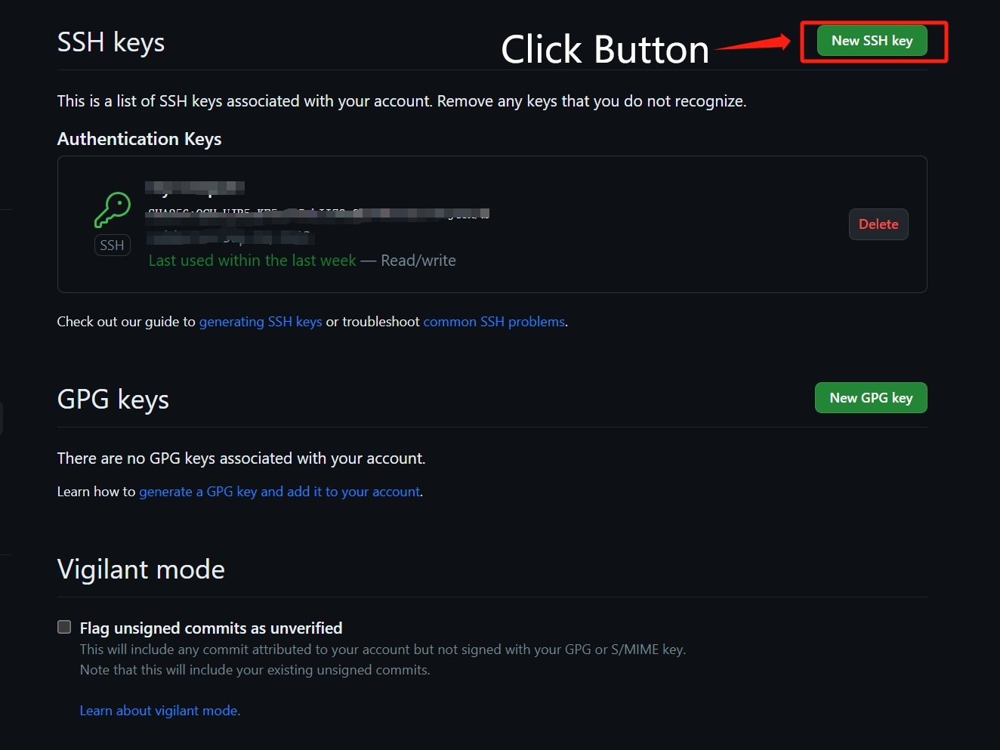

## 查看当前已经存在的所有SSH

该命令将列出所有本地已经存在从SSH密钥

```
ls -al ~./ssh
```

文件名为`xxx.pub`的是SSH公钥，不带`.pub`后缀的同名文件为私钥  
如果已经存在我们可以选择继续使用

如果已经存在的SSH当前已经关联账号，那可以生成一个新的SSH

## 生成SSH密钥

使用该命令后将会在`.ssh`目录中生成`.id_rsa`和`.id_rsa.pub`两个存储私钥和公钥的文件

```
ssh-keygen -t rsa
```

## 查看SSH公钥

在控制台中切换到ssh目录下

```
cd ~/.ssh
```

查看密钥

```
cat id_rsa_.pub
```

将密钥进行复制

## Github配置SSH

打开 [Github SSH配置页面](https://github.com/settings/keys)

点击图片中的按钮



> 设置好 **title** 后将刚才复制的 **SSH** 密钥粘贴到下面的 **key** 输入框  
> 点击 **Add SSH key** 配置SSH完成

此时我们就已经完成了**Github SSH**的配置

## 如果你有多个Github账号继续下面的操作

### 重复上面的操作生成SSH

- 进行标记`-C "xxx@mail.com"`
- 对文件名进行自定义`-f "xxx"`

```
ssh-keygen -t rsa -C "email@work_mail.com" -f "id_rsa_work_user1"
```

可以看到 `.ssh` 目录下将新增两个文件，文件名为刚才 `-f xxx` 自定义的名称 **xxx**

查看 `xxx.pub` 文件复制密钥

```
cat xxx.pub
```

打开另一个 **Github** 账号进入到 `SSH` 配置页面进行配置

## 注册SSH密钥

完成了上述操作之后需要通过 `ssh-agent` 注册SSH密钥

确保 `ssh-agent`能够正常运行先执行下面命令

```
eval "$(ssh-agent -s)"
```

注册新增的 `SSH`

```
ssh-add ~/.ssh/id_rsa
ssh-add ~/.ssh/xxx
```

## 创建SSH配置文件

这里是为了给不同的SSH配置匹配规则
查看当前 `.ssh` 目录下是否存在 `config`文件

- 不存在，创建 `config` 文件并打开
- 存在，打开 `config` 文件

输入以下内容

- **hostName** 后续使用 `git clone url`中的标识
- **IdentityFile** 是配置ssh私钥的路径，`xxx` 为上面步骤中自定义的文件名

```
Host github.com
  HostName github.com
  User git
  IdentityFile ~/.ssh/id_rsa

Host github.com
  HostName github.com-yyy
  User git
  IdentityFile ~/.ssh/xxx
```

上述表述

- `git@github.com:wpolairs/Jerry-s-world.git`使用`id_rsa`这个文件
- `git@github.com-yyy:wpolairs/Jerry-s-world.git`使用`xxx`这个文件

此时我们便可以对仓库代码进行 `clone`
